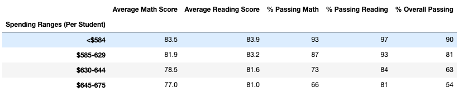

# School_District_Analysis

## Overview of the School District Analysis
Aggregate data from multiple schools within City School District. The data provided was in different formats and included standardized test results (math and reading), spending and students information. The original cvs data files can be found in the resource folder. 

### Purpose
The purpose of this analysis is to review the data to provide insight to the City School District regarding performance trends and spend. This analysis will allow the school, district, and superintendent to make informed decisions for next year budget allocation.  

### Process
The initial analysis was done as directed by the City School District.  It was identified that some grades may have been altered.  A second analysis was done to remove altered data and reaggregate the results.  The second analysis ensures schools and students are treated fairly in the budgeting process across the district.

## Results
Thomas High School’s 9th grade reading, and math scores were identified as being altered.  The code being submitted in this challenge has 2 main deliverables centered around cleaning up the altered data and rerunning the analysis.  

### Deliverable 1
Deliverable 1 removed the altered 9th grade math and reading scores from Thomas High School.  We did not just delete the grades from the data frame.  We replaced the corrupted data with NaN using the loc method in python.  Below you will find a snippet of the data frame showing only the 9th grade reading and math scores were replaced.  The snippet does not include all columns to protect student identities.      

### Deliverable 2
The 2nd deliverable was to rerun the school district analysis with corrected data. 

**District Summary**

Below we will find a snapshot of the updated District Summary:

The first question asked is did the district summary change.  The answer is no it did not change overall.  We only excluded a small population from the larger data set.  From a district perspective, there was little impact in the aggregated data.  

The contrast to this is at the school level.  Below we can see a summary per school BEFORE removing the 9th grade data from Thomas High School.

Let’s take a closer look at Thomas High School since this was the only school that had data altered. Thomas High School Performance Summary after replacing 9th grades reading and math scores: 

Thomas High School Summary | Thomas High School Summary Updated
-------------------------- | -----------------------------------
Average Math Score: 	83.4	|	Average Math Score Updated: 83.3
Average Reading Score: 83.9		|Average Reading Score Updated: 83.9
% Passing Math:  66.9	|	% Passing Math Updated: 93.2
% Passing Reading: 69.7 |		% Passing Reading Updated: 97.0
% Overall Passing: 65.1	|	% Overall Passing Updated: 90.6

The largest changes were in the percentage of students passing both reading and math tests. Passing was defined as any grade above 70.  Overall passing grades at Thomas High School were also increased. 

Updated Per School Summary

To assist the City School Board, we aggerated the school scores by school type and school spend.  We hope that this binned information will help in next year’s budget.

Scores by School Spending

Scores by School Size

Scores by School Type

 

## Summary

School districts have the hard task of allocating budget money each year.  One of the deciding factors on how schools are rated and receive money is based on the standardized test of their students.  Exactly how the district uses the data from the schools to assign budget was outside of the scope of this report.  What we can speak to is the importance of grade integrity on the overall picture of a school.  If we had not removed the 9th grade math and reading scores from Thomas High School (THS), THS would have been rated with lower math, reading and overall passing percentages.  

Other interesting findings were significant improvement of passing percentages of Charter schools over district schools.  The data suggests the difference may be in the total students at the school.  The schools performed better when in the medium or small category compared to larger schools.  One piece of information missing to truly understand is the teacher population.  From the data provided, we do not know the student to teacher ratios and how those ratios impact school performance results. 

